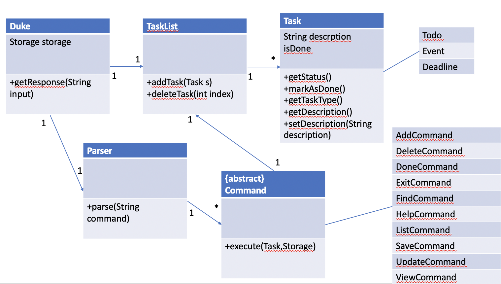

## Developer Guide

### Acknowledgements

- [docs.oracle.com Java time References](https://docs.oracle.com/en/java/javase/11/docs/api/java.base/java/time/LocalDateTime.html)
- [Java Streams Reference](http://tutorials.jenkov.com/java-functional-programming/streams.html)
- Raoul-Gabriel Urma, Mario Fusco, Alan Mycroft, *Modern Java in Action: Lambdas, streams, functional and reactive programming 2nd Edition*, Manning, 2018.
- Author: Wan Yin

### Design

**Duke Command Line Application** consists of a total five Java classes, namingly **Duke, Command, Parser, Task and Storage**. 

It makes optimal use of Java Stream and the latest java time APIs, e.g. LocalDateTime and LocalDate, among others, together with a judicious choice of data structures, to allow a single user to create and manage tasks fast:

- Each task  entry is stored in `data/tasks.txt` data structure.

- The **Task** class will capture all tasks input by the user.

- Data structure, `Arraylist<Task>`, chosen for efficient search/retrieval, is used to store a list of tasks.

## Implementation

#### Class Diagram:

Fig 1. - Duke Class Diagram   

#### Sequence Diagram:

Fig 2. - Sequence Diagram Illustration  

## Product scope
**Target user profile:**

- has a need to manage a number of tasks
- prefer desktop apps vs other types
- can type fast
- comfortable using the keyboard and mouse interactions
- is reasonably comfortable using CLI apps

**Target user:**

User: Felicia

Age: 18 (typical)

Occupation: Student

Education: Currently in Poly or JC

Commitments: CCAs, recreational activities, Studies

Traits: Is technologically literate, active in activities, comfortable typing commands

Our target user is a Student that is currently schooling. As an active student, the Target User has multiple tasks that may be hard to keep track of. 

With the help of Duke, Felicia will be able to manage her tasks smoothly.

### Value proposition

Duke provides a user-friendly, consistent and error-free interface, as well as helpful message feedback or alerts to users, throughout the app use. 

Using the CLI-type interface, the user will be able to manage tasks easily with minimal commands / single commands.

Users are able to create, update, delete, view, and find task in real-time using this application.

## User Stories

|Version| As a ... | I want to ... | So that I can ...|
|--------|----------|---------------|------------------|
|v1.0|new user|see help usage instructions|refer to them when I forget how to use the application|
|v1.0|regular user|I can add in a task in one line|make an entry and have it stored online fast|
|v1.0|a quick user|I can edit a task's date|modify an task's date easily at will|
|v1.0|date planner|I find a task item by specfic date|locate a task on 22th without having to go through the entire list|
|v1.0|systematic student|I can see my list upfront |know what tasks I have for the day|
|v1.0|effective student|I can mark task that are completed |what tasks have been cleared.|
|v1.2|student who prefer GUI|I can view my task with visual display|view all my tasks easily|
|v2.0|structured student|I want to see tasks with relevant keywords|view relevent tasks|
|v2.0|organised student|I can delete task |remove unwanted tasks on my list|
|v2.0|busy student|I can quit the application immediately with an automatic save|move on to my other activities quickly|

## Non-Functional Requirements
1. Users are able to run the application as long as Java11 is installed
2. The application has been designed to handle up to 100’s of task optimally without affecting its performance.
3. The application should preferably be executable on Windows OS or compatible software-emulated terminal.
4. User-friendly features incorporated in helpful messages feedback and diagnostic prompts (more to come)

## Glossary

* **Mainstream OS** - Windows, Linux, Unix, OS-X
* **JustBook App**  - A single-user command line app for making and storing student bookings online
* **CLI**           - Command Line Interface
* **booking**       - A typed entry consisting of booking text description, a start DateTime and end DateTime
* **ISO (time standard)** - For Java time Standards, it follows this format: "yyyy-MM-dd HH:mm"
* **DateTime**     - Java LocalDateTime implemented with format as "yyy-M-d HH:mm", using a 24 hr format

## Instructions to get started

1. Ensure you have Java 11 or above installed in your Computer.
2. Download the latest [jar](https://github.com/yinyin377/ip/releases) file here.
3. Copy the file to the folder you want to use as the home folder. Your tasks will be saved to and loaded from data/tasks.txt located in the same folder.
4. Double-click the file to start the app. The GUI should appear in a few seconds.
5. Type the command in the text box and press Send to execute it.
